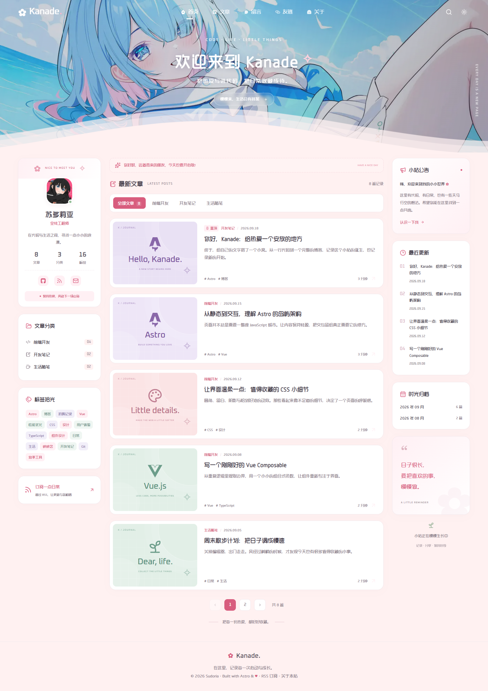

<div align="center">

# Kanade · 奏

一个记录热爱与日常的个人博客。

基于 Astro、Vue 和 Tailwind CSS 构建，以插画首屏、粉色圆角卡片和轻盈波浪，收藏代码、灵感与生活。

[项目仓库](https://github.com/sudoriaa/Kanade-Astro) · [快速开始](#快速开始) · [文章写作](#文章写作) · [部署指南](#部署指南)

</div>

## 界面预览



桌面端采用「个人信息与分类 / 文章列表 / 站点动态」三栏布局；手机端聚焦文章阅读，导航收起为菜单。内置浅色与深色主题，保留原有头像、字体和首屏插画。

## 功能一览

| 模块 | 功能 |
| --- | --- |
| 首页与归档 | 文章卡片、分类切换、标签筛选、月份归档、分页，筛选条件随 URL 保存 |
| 全站搜索 | 匹配标题、摘要、分类和标签，支持多关键词、空结果提示与键盘操作 |
| 文章阅读 | Markdown 正文、代码高亮、代码复制、文章目录、阅读进度、链接分享、相邻文章 |
| 站点页面 | 友链、关于、留言、404 页面，以及旧文章和留言路径跳转 |
| 主题与适配 | 深浅主题切换与偏好保存、移动端菜单、响应式布局、减少动态效果偏好支持 |
| 本地留言 | 昵称与内容校验、表情、保存、删除，以及浏览器存储异常提示 |
| 订阅与元数据 | RSS、站点地图、robots.txt、独立页面标题与描述、canonical、Open Graph |

文章数量、分类、标签和侧栏最近更新均从内容库生成。仓库附带 8 篇示例文章，方便查看排版并开始写作。

## 技术栈

| 技术 | 用途 |
| --- | --- |
| Astro 5 | 页面路由、内容集合与静态构建 |
| Vue 3 | 搜索、筛选、导航和留言等交互组件 |
| Tailwind CSS 4 | 样式工具与主题基础 |
| TypeScript 5 | 类型约束与静态检查 |
| Iconify | 页面图标 |
| Playwright | 桌面与手机布局的浏览器测试 |
| pnpm | 依赖管理 |

页面以静态 HTML 输出，需要交互的 Vue 组件按需水合。日常写作无需数据库，构建产物位于 `dist/`。

## 快速开始

准备 Node.js 22.12 或更高版本，以及 pnpm 10。

```sh
git clone https://github.com/sudoriaa/Kanade-Astro.git
cd Kanade-Astro
pnpm install --frozen-lockfile
pnpm dev
```

浏览器打开 [http://localhost:4321](http://localhost:4321)。

### 常用命令

| 命令 | 说明 |
| --- | --- |
| `pnpm dev` | 启动开发服务器 |
| `pnpm check` | 检查 Astro、Vue 与 TypeScript |
| `pnpm build` | 生成静态站点到 `dist/` |
| `pnpm preview` | 预览构建产物 |
| `pnpm test` | 运行浏览器测试，需要先构建 |
| `pnpm deploy:local` | 在 Windows 后台启动构建产物预览 |

## 项目结构

```text
Kanade-Astro/
├── public/
│   ├── fonts/                # 本地字体
│   ├── images/               # 头像、首屏插画
│   └── favicon.svg
├── src/
│   ├── components/
│   │   ├── header/           # 导航、搜索、欢迎区域、波浪
│   │   ├── home/             # 个人卡片与左右侧栏
│   │   ├── posts/            # 文章封面、列表与筛选
│   │   └── Guestbook.vue     # 本地留言
│   ├── content/posts/        # Markdown 文章
│   ├── data/friends.ts       # 友链数据
│   ├── layouts/              # 基础布局与三栏布局
│   ├── lib/posts.ts          # 文章读取、摘要与标签
│   ├── pages/                # 页面、文章详情、RSS 等路由
│   ├── scripts/theme.ts      # 主题切换
│   ├── styles/global.css     # 字体、主题变量与全局样式
│   ├── config.ts             # 站点与作者配置
│   └── content.config.ts     # 内容集合与文章字段校验
├── scripts/preview.ps1       # Windows 后台预览脚本
├── tests/blog.spec.ts        # 浏览器测试
├── .env.example              # 环境变量示例
├── netlify.toml              # Netlify 构建配置
└── playwright.config.ts
```

## 文章写作

在 [src/content/posts/](src/content/posts/) 中新增 Markdown 文件，例如 `my-first-post.md`：

```markdown
---
title: "我的第一篇文章"
description: "用一两句话介绍这篇文章。"
date: 2026-09-20
category: "开发笔记"
tags: ["Astro", "博客"]
cover: "notes"
featured: false
draft: false
---

## 从这里开始

把想记录的事情写下来。
```

文章路径由文件名生成，以上示例对应 `/posts/my-first-post/`。保存后，开发服务器会刷新内容；正式站点需要重新构建和发布。

### 文章字段

| 字段 | 必填 | 说明 |
| --- | --- | --- |
| `title` | 是 | 文章标题 |
| `description` | 是 | 列表、搜索和页面元数据使用的摘要 |
| `date` | 是 | 发布日期，建议使用 `YYYY-MM-DD` |
| `category` | 是 | 前端开发、开发笔记、生活随笔之一 |
| `tags` | 是 | 标签数组，可为空数组 |
| `cover` | 是 | 封面样式名称 |
| `featured` | 否 | 显示「置顶」标记和特色封面，默认为 `false` |
| `draft` | 否 | 草稿标记，默认为 `false`；草稿不进入页面、搜索和订阅 |

支持的封面样式：`astro`、`vue`、`css`、`notes`、`life`、`typescript`、`git`、`design`。

文章按发布日期倒序排列；`featured` 控制展示标记，当前不改变排序。阅读时间根据正文字符数估算。搜索范围为标题、摘要、分类和标签，不包含文章全文。

需要新增分类时，同步调整 [内容字段约束](src/content.config.ts)、[分类数据](src/lib/posts.ts) 和 [列表分类选项](src/components/posts/PostFeed.vue)。

## 个性化配置

| 配置位置 | 可修改内容 |
| --- | --- |
| [src/config.ts](src/config.ts) | 站点名称、描述、关键词、导航、欢迎语、背景、作者与社交链接 |
| [src/data/friends.ts](src/data/friends.ts) | 友链名称、介绍、地址、图标与配色 |
| [src/styles/global.css](src/styles/global.css) | 字体、主题色、卡片、间距与响应式布局 |
| [src/pages/about.astro](src/pages/about.astro) | 关于页的个人介绍与站点说明 |
| [public/images/](public/images/) | 头像和首屏图片 |
| [.env.example](.env.example) | 正式站点地址示例 |

首屏、作者介绍与示例文章可以按自己的风格替换。站点中的部分公告和介绍位于页面或侧栏组件中，可直接编辑对应文字。

### 快捷操作

- `Ctrl + K` / `⌘ + K`：打开全站搜索。
- `Esc`：关闭搜索弹窗或手机导航菜单。
- 导航栏太阳 / 月亮按钮：切换主题并保存偏好。
- 文章目录：跳转至对应标题；阅读时显示当前章节。
- 文章代码块右上角按钮：复制代码。

复制功能依赖浏览器剪贴板能力；访问正式站点时建议使用 HTTPS，当前浏览器不支持时界面会提示手动复制。

## 留言说明

当前留言页是本地留言本，数据保存在当前浏览器的 `localStorage`：

- 留言仅自己可见，不会发送给站长，也不会跨设备同步。
- 最多保存 100 条，昵称最多 24 字，内容最多 500 字。
- 刷新页面后仍可查看；删除留言或清除站点数据后，相应内容会被移除。
- 内容按纯文本渲染，存储被禁用或空间不足时会显示未保存提示。

如需多人可见的公开留言，可以在 [Guestbook.vue](src/components/Guestbook.vue) 对应位置接入评论服务或后端接口。

## 部署指南

### 设置站点地址

将 `.env.example` 复制为 `.env`，填写最终域名：

```dotenv
SITE_URL=https://your-blog.example
```

也可以直接在托管平台设置同名环境变量。修改后重新构建，RSS、站点地图、canonical 和 Open Graph 中的地址会随之更新。未设置时默认使用 `http://localhost:4321`。

当前路由和资源使用根路径，适合部署在独立域名或子域名的根目录。若使用 `/Kanade-Astro/` 这类子路径，需要同时调整 Astro 的基础路径、页面链接与资源引用。

### 本地预览

```sh
pnpm build
pnpm preview --host 0.0.0.0 --port 4321
```

本机打开 [http://localhost:4321](http://localhost:4321)。同一局域网中的设备可以通过电脑的局域网 IP 和对应端口访问，具体取决于网络和防火墙配置。

Windows 支持在后台启动：

```powershell
pnpm build
pnpm deploy:local

# 指定其他端口
pnpm deploy:local -Port 4322
```

脚本会检查端口、启动隐藏窗口的预览进程，并验证首页返回状态码 200。日志和进程信息保存在 `.preview/`，该目录已被 Git 忽略。

停止预览时，先查看 `.preview/server-4321.json` 中的 `pid`，核对对应进程后执行：

```powershell
Stop-Process -Id <进程ID>
```

`astro preview` 用于查看构建产物；公网访问请将 `dist/` 发布到静态托管平台或静态 Web 服务器。

### 静态托管

| 配置项 | 值 |
| --- | --- |
| Node.js | 22.12+ |
| 安装命令 | `pnpm install --frozen-lockfile` |
| 构建命令 | `pnpm build` |
| 发布目录 | `dist` |
| 环境变量 | `SITE_URL`，设置为实际访问域名 |

仓库已提供 [netlify.toml](netlify.toml)。导入 Netlify 时可沿用其中的构建与旧路径重定向配置。使用其他静态托管平台时，填写上表中的构建参数。

部署完成后可检查：

- `/`：首页。
- `/posts/`：文章列表。
- `/rss.xml`：文章订阅。
- `/sitemap.xml`：站点地图。
- `/robots.txt`：爬虫规则。
- 任意不存在的路径：站点 404 页面。

## 检查与测试

```sh
pnpm check
pnpm build
pnpm exec playwright install chromium
pnpm test
```

Linux CI 环境可使用 `pnpm exec playwright install --with-deps chromium` 安装浏览器及所需系统依赖。

如果本机已有 Microsoft Edge，可在 PowerShell 中指定浏览器：

```powershell
$env:PLAYWRIGHT_CHANNEL = "msedge"
pnpm test
```

测试会启动 `http://127.0.0.1:4173` 上的构建预览。当前提供 10 组场景，分别在桌面视口与手机模拟视口下运行，共 20 项：

- 分类、分页与 URL 状态恢复。
- 标签、月份及空结果处理。
- 搜索、快捷键和关闭后的焦点恢复。
- 深浅主题在刷新和跨页面后的保留。
- 留言保存、输入转义、刷新与删除。
- 损坏存储、空白输入及禁用存储的处理。
- 文章目录、代码块和相邻文章跳转。
- 页面横向溢出、图片加载和浏览器错误。
- 手机导航菜单。
- RSS、站点地图、404 与旧路径跳转。

测试结果、失败截图与追踪文件输出到 `test-results/`，不进入版本控制。

## 素材与致谢

- 首屏插画沿用原项目配置中的[图片资源](https://img2.huashi6.com/images/resource/thumbnail/2025/02/09/23269_76985257670.jpg)，保留图中的原作者标记，并存放为本地文件。
- 头像及「造字工房悦圆」「Oxanium」字体沿用原仓库。
- 感谢 Astro、Vue、Tailwind CSS、Iconify 和 Playwright 等开源项目。

愿每一份热爱，都有一个安放的地方。
